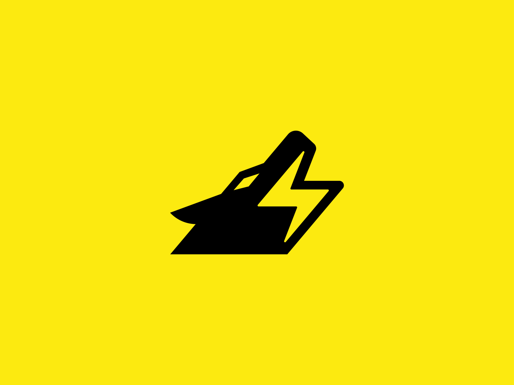

<div align="center">
  
  <h1>Documentary Template for Web</h1>
  <p><b>A clean, static starting point for documentation sites.</b><br/>Lightweight HTML/CSS/JS template with top navigation, a sidebar of section links, and a content area you fill with your own docs.</p>
  <p>
    <a href="LICENSE"></a>
    
    
    
    
  </p>
</div>

---

A lightweight, static HTML/CSS/JavaScript template for building documentation
websites. It ships a ready-made layout — top navigation, a left-hand sidebar of
section links, and a content area — that you fill in with your own docs.

## Features

- Clean documentation layout with top nav bar and sidebar navigation
- Placeholder sections (`{Title}`, `{Side Title}`) ready to be replaced
- Light theme via `data-theme` on the `<html>` element
- Styled with Sass (SCSS source compiled to CSS)
- Google Fonts (Roboto Mono) and a logo slot

## Tech Stack

- HTML5
- CSS / Sass (SCSS)
- Vanilla JavaScript

## Structure

```
index.html        # page markup (nav, sidebar, content)
css/
  style.scss      # Sass source
  style.css       # compiled CSS (with source map)
js/main.js        # page interactions
assets/logo.png   # logo
```

## Usage

1. Open `index.html` directly in a browser, or serve the folder with any static
   server (e.g. `python -m http.server`).
2. Replace the `{Title}` / `{Side Title}` placeholders and content with your own.
3. If you edit styles, recompile the Sass:
   ```bash
   sass css/style.scss css/style.css
   ```

## License

Released under the [MIT License](LICENSE) © 2026 Olivier Lüthy. You're free to use, modify and distribute this
software, including commercially, as long as the copyright notice and license are included.

## Author

Built by **Olivier Lüthy** — [GitHub](https://github.com/olivierluethy).
